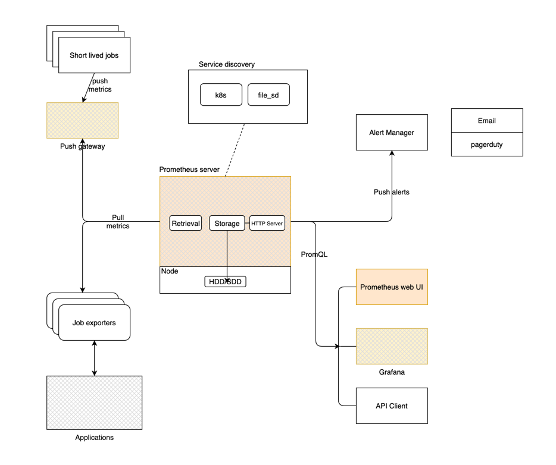

## Prometheus Architecture

#### Different ways to monitor applications

- Use existing exporters
- use prometheus push gateway
- Build a new exporter into your client app
- Create your own exporter

## Exporters
- any application that exposes metric data in a format that is collectable by the prometheus server. 

Example:
- Node exporter collects various system metrics server / exposes to prometheus. 

