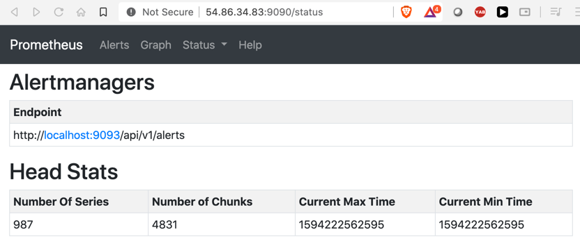

## Alert manager
- manages alert


#### What can you do using Alert manager.
- Group multiple alerts together when occurring at the same time. 
- deduplicate alerts when multiple clients are sending the same alert. 
- Route alerts to proper destination such as email or another alert app such as pagerduty


#### Installing alert manager
Different ways - precompiled binaries, docker images, compile from source. 
- Can install alert manager in seprate vm or on the same vm as alert manager. 

- Create a user for the alert manager
```shell script
sudo useradd -M -r -s /bin/false alertmanager
less /etc/passwd
```

- Extract the alert manager binary, extract them, install and assign ownership / privelege to user
```shell script
wget https://github.com/prometheus/alertmanager/releases/download/v0.20.0/alertmanager-0.20.0.linux-amd64.tar.gz
tar xvfz alertmanager-0.20.0.linux-amd64.tar.gz

sudo cp alertmanager-0.20.0.linux-amd64/{alertmanager,amtool} /usr/local/bin/
sudo chown alertmanager:alertmanager /usr/local/bin/{alertmanager,amtool}
sudo mkdir -p /etc/alertmanager
sudo cp alertmanager-0.20.0.linux-amd64/alertmanager.yml /etc/alertmanager
sudo chown -R alertmanager:alertmanager /etc/alertmanager
sudo mkdir -p /var/lib/alertmanager
sudo chown alertmanager:alertmanager /var/lib/alertmanager
```

- Configure amtool to point to alert manager to validate. 
```
sudo mkdir -p /etc/amtool
sudo vi /etc/amtool/config.yml
```
Enter the following contents in config.yml

```text
alertmanager.url: http://localhost:9093
```
```text
sudo vi /etc/systemd/system/alertmanager.service
```
Add the following comamnds:

```text
[Unit]
Description=Prometheus Alertmanager
Wants=network-online.target
After=network-online.target

[Service]
User=alertmanager
Group=alertmanager
Type=simple
ExecStart=/usr/local/bin/alertmanager \
  --config.file /etc/alertmanager/alertmanager.yml \
  --storage.path /var/lib/alertmanager/

[Install]
WantedBy=multi-user.target
```

```shell script
sudo systemctl enable alertmanager
sudo systemctl start alertmanager
sudo systemctl status alertmanager

curl localhost:9093

```

Verifiy amtool is able to connect to alert manager and retrieve the current configuration. 
```shell script
amtool config show
```

```shell script
sudo vi /etc/prometheus/prometheus.yml
```

```yaml
alerting:
  alertmanagers:
  - static_configs:
    - targets: ["localhost:9093"]
```

```shell script
sudo systemctl restart prometheus

```

Check in prometheus dashboard if alert manager is configured. 



### Configuring Alerts

#### Chaing global alert configuration:
sudo vi /etc/alertmanager/alertmanager.yml

change say:

resolve_timeout: 15m

- restart alert manager. 

#### How to reload alert manager configurations
- send a SIGHUP signal to Alert manager process.
- sudo killall -HUP alert manager
- Send a http post method to reload. (/reload endpoint)

sudo systemctl restart alertmanager
(or)
sudo killall -HUP alertmanager

Verify if configuration has changedL:
http://<prometheus-server>:9093/#/status


## Create a new alert 

#### Speficy the location where pormetheus will look for alerts
```shell script
sudo vi /etc/prometheus/prometheus.yml
```
Modify the rule file location
```text
rule_files:
- "/etc/prometheus/rules/*.yml"
  # - "second_rules.yml"
```

```
sudo mkdir -p /etc/prometheus/rules/
```

sudo vi /etc/prometheus/rules/my-alerts.yml

```text
groups:
- name: Linux-server
  rules:
  - alert: LinuxServerDown
    expr: up(job="Linux Server"} == 0
    labels:
      severity: critical
    annotations:
      summary: Linux server is down.. !!
```
```text
sudo systemctl restart prometheus
```

#### TEst if the alert works fine.

Stop the node-exporter service
```text
sudo systemctl stop node_exporter
```


Test the alert

Start the server back:
sudo systemctl start node_exporter
