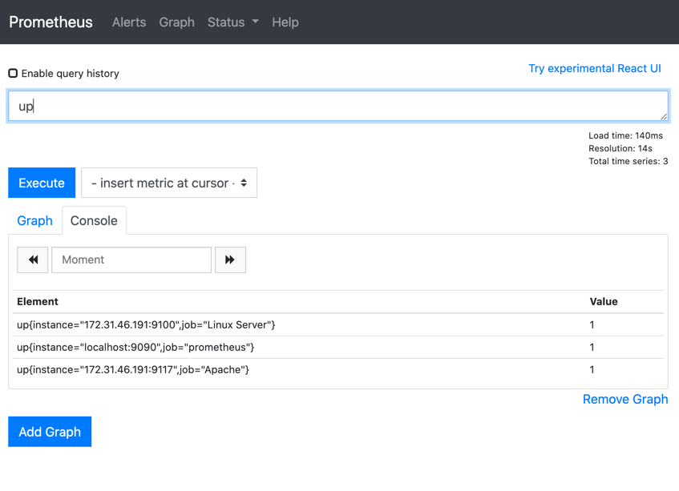

#### Instance:
- is a single app that is being monitored.
Example:
- 5 different apache servers. 

#### Job:
- collection of instances sharing the same purposes.
Example:
- api server that runs 3 different instances. 

#### Scrape meta metrics:
- up{job="<job-name>", "instance=<instance-id>"}
- scrape_duration_seconds{job="<job-name>", instance="<instnace-id" }

