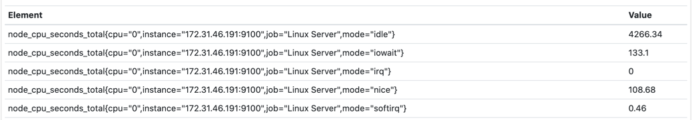
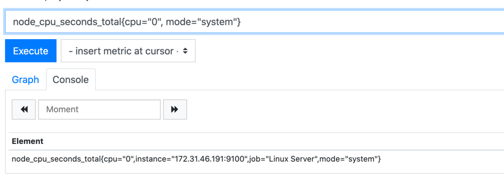
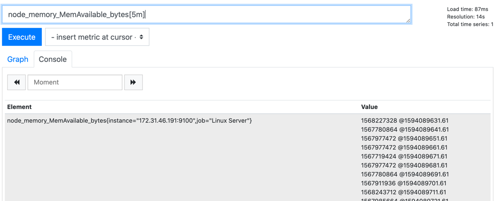
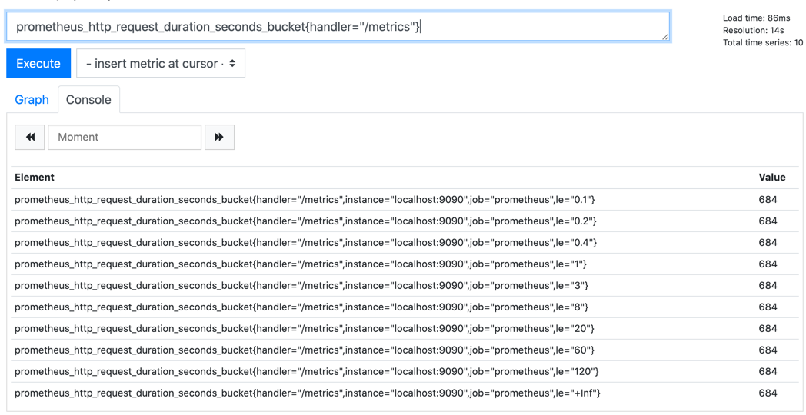
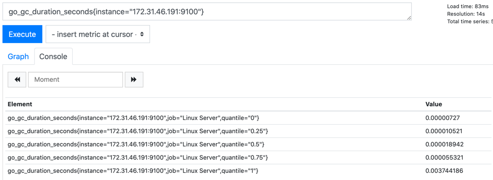

#### metric name
metric name refers to the attribute being measured. 
- probably returns multiple data points. 

#### metric label
- labels are used to provide dimensional data model. 



metric name can have more than one labels.

#### Queriying
You can use the metric name / label to query / filter results. 




### Metric types

#### Counter
- a number that can only increase or set to zero. 

```text
node_cpu_seconds_total[5m]
```

#### Guage
- single number that can increase or decrease over time. 
- Example, current cpu usage now, no. of http request, memory usage, active threads. 

```text
node_memory_MemAvailable_bytes[5m]
```


#### Histogram
- represents series of data. 
- has _sum & _count
```
prometheus_http_request_duration_seconds_sum{handler="/metrics"}
prometheus_http_request_duration_seconds_count{handler="/metrics"}
```


#### Summary
- represent data in terms of a quantile (similar to percentile)



