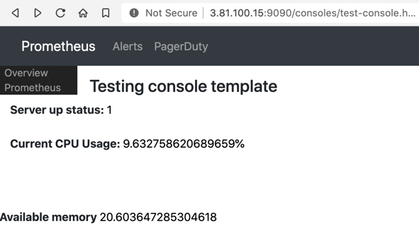
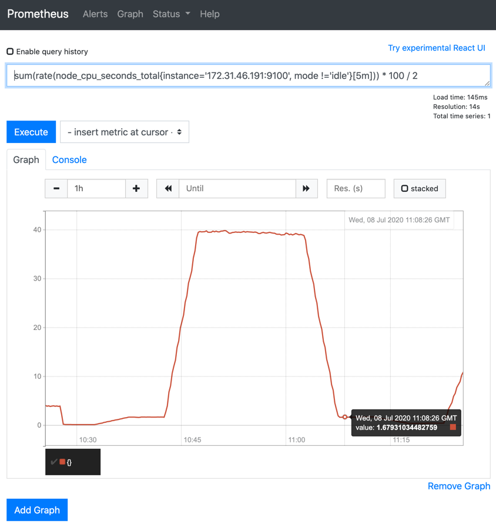
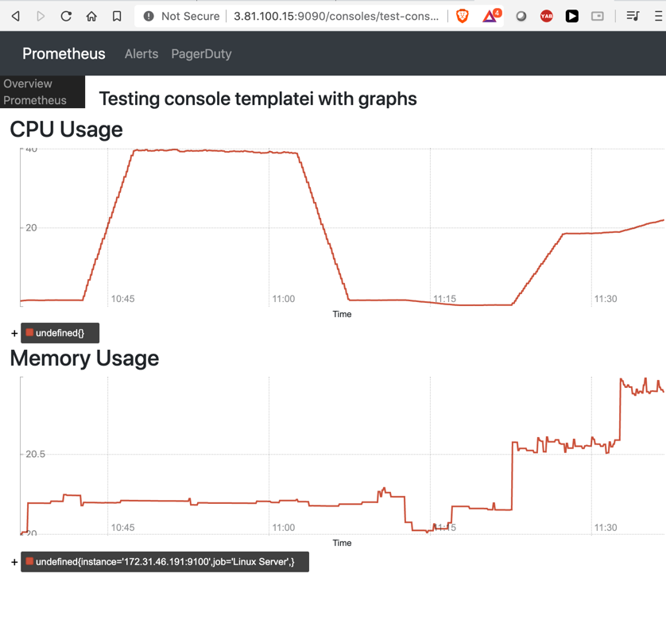

## Console templates

#### What are console templates
- are template html files that are used to view information in prometheus in a separate console. 
- allows user to have template metrics placeholders that will be replaced by prometheus

#### How to create console templates
- Create a html file in /etc/prometheus/consoles/test-console.html with the following contents

```html
{{template "head" .}}
{{template "prom_content_head" .}}

<h4> Testing console template</h4>
<b> Server up status: </b> {{ template "prom_query_drilldown" (args "up{job='Linux Server'}") }}

<br><br>
<b> Current CPU Usage: </b> {{ template "prom_query_drilldown" (args "sum(rate(node_cpu_seconds_total{instance='172.31.46.191:9100', mode !='idle'}[5m])) * 100 / 2" "%") }}
{{template "prom_content_tail" .}}

<br><br>

<b> Available memory </b> {{ template "prom_query_drilldown" (args "100 - ( node_memory_MemAvailable_bytes  / node_memory_MemTotal_bytes ) * 100" "%") }}

{{template "tail"}}
```

- view the console in the browser


- You can drill down to see more details on the data. 



Template syntax:
```html
{{
   template "prom_query_drilldown" 
   (
        args "<query_string>" "append value"
   )
}}```

#### Console templates with graphs. 

- Create a html file in /etc/prometheus/console with the followin graph nodes
```html
{{template "head" .}}
{{template "prom_content_head" .}}

<h4> Testing console templatei with graphs</h4>


<h3> CPU Usage </h3>
<div id = "cpuGraph"></div>
<script>
        new PromConsole.Graph({
                node: document.querySelector("#cpuGraph"), 
                expr: "sum(rate(node_cpu_seconds_total{instance='172.31.46.191:9100', mode !='idle'}[5m])) * 100 / 2"
        })
</script>


<h3> Memory Usage </h3>
<div id = "memoryGraph"></div>
<script>
        new PromConsole.Graph({
                node: document.querySelector("#memoryGraph"), 
                expr: "100 - ( node_memory_MemAvailable_bytes  / node_memory_MemTotal_bytes ) * 100"
        })
</script>


{{template "prom_content_tail" .}}

{{template "tail"}}
```


- View the graph details


