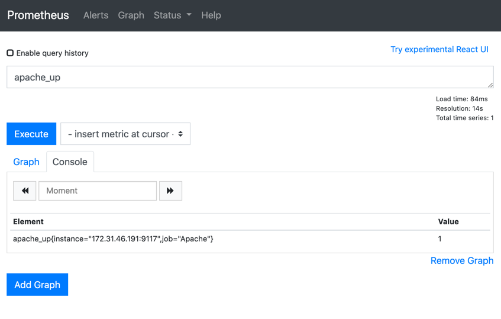

## Exporters with Prometheus

#### Install your application - Apache server and apache exporter
- Install apache server
- Install apache exporter 
- Add apache exporter as a service and start the service. 
- Check if the metrics endpoint is accessible (localhost:9117/metrics)

```shell script
sudo apt-get install -y apache2
curl localhost:80

sudo useradd -M -r -s /bin/false apache_exporter
wget https://github.com/Lusitaniae/apache_exporter/releases/download/v0.7.0/apache_exporter-0.7.0.linux-amd64.tar.gz
tar xvfz apache_exporter-0.7.0.linux-amd64.tar.gz
sudo cp apache_exporter-0.7.0.linux-amd64/apache_exporter /usr/local/bin/
sudo chown apache_exporter:apache_exporter /usr/local/bin/apache_exporter
sudo vi /etc/systemd/system/apache_exporter.service
```

Add the below content for the service
```text
[Unit]
Description=Prometheus Apache Exporter
Wants=network-online.target
After=network-online.target

[Service]
User=apache_exporter
Group=apache_exporter
Type=simple
ExecStart=/usr/local/bin/apache_exporter

[Install]
WantedBy=multi-user.target
```
Enable nad start apache exporter service
```shell script
sudo systemctl enable apache_exporter
sudo systemctl start apache_exporter
sudo systemctl status apache_exporter

curl localhost:9117/metrics
```

#### Add a 
- sudo vi /etc/prometheus/prometheus.yml
```shell script
  - job_name: 'Apache'
    static_configs:
    - targets: ['172.31.46.191:9117']
```
Restart prometheus

```shell script
sudo systemctl restart prometheus
```

#### Check if apache worker is working

