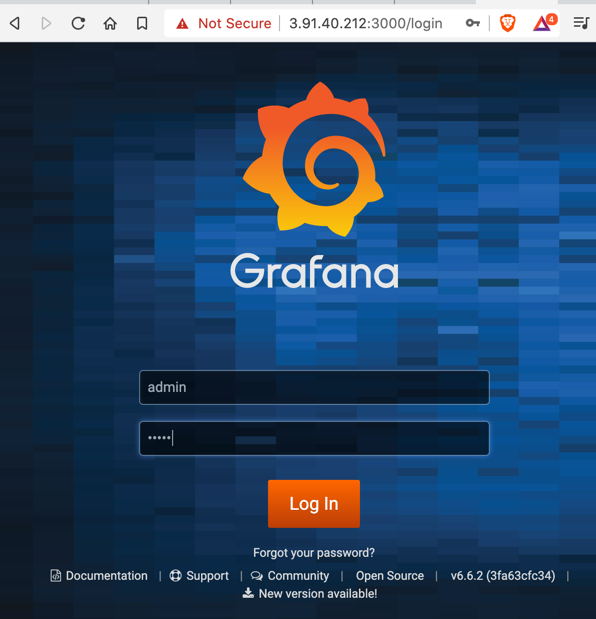
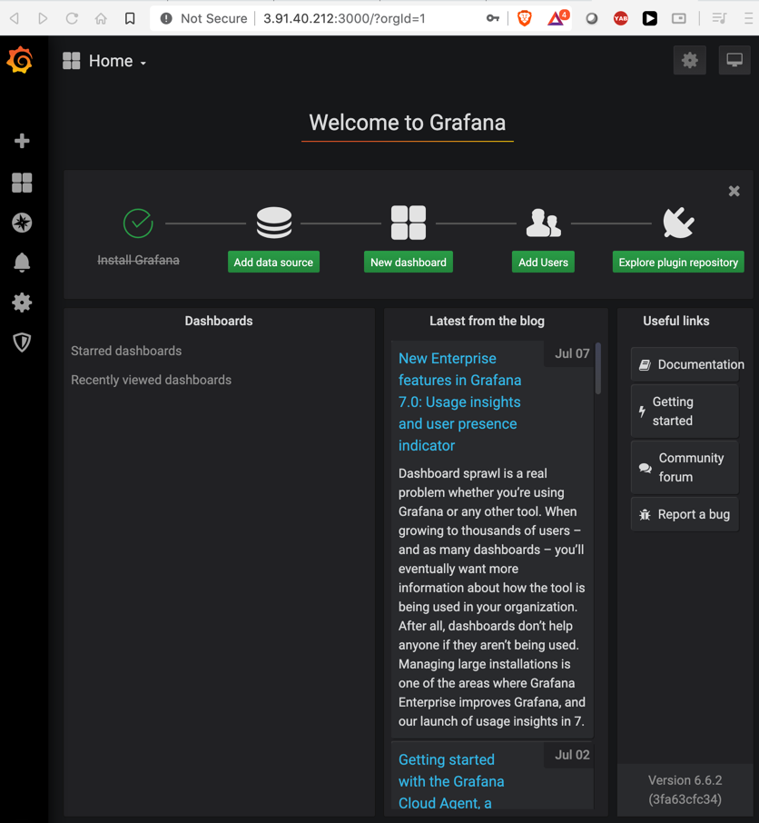
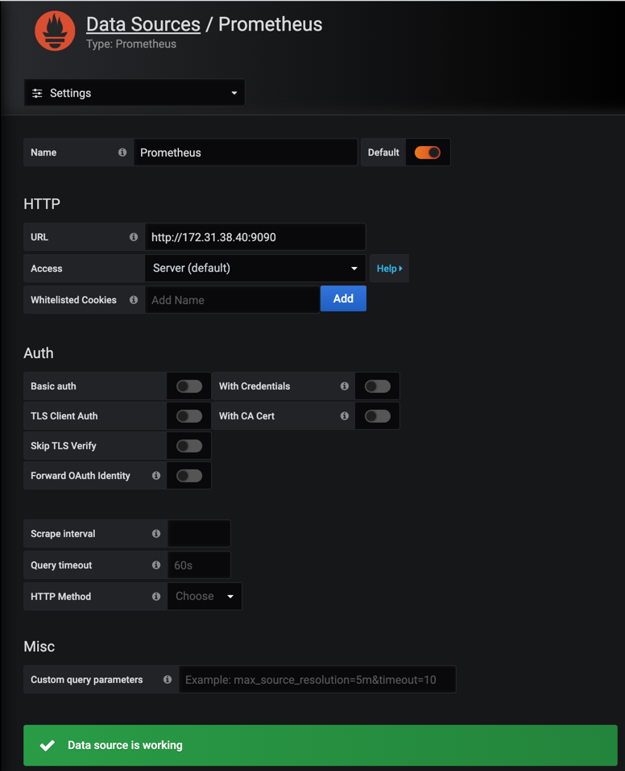
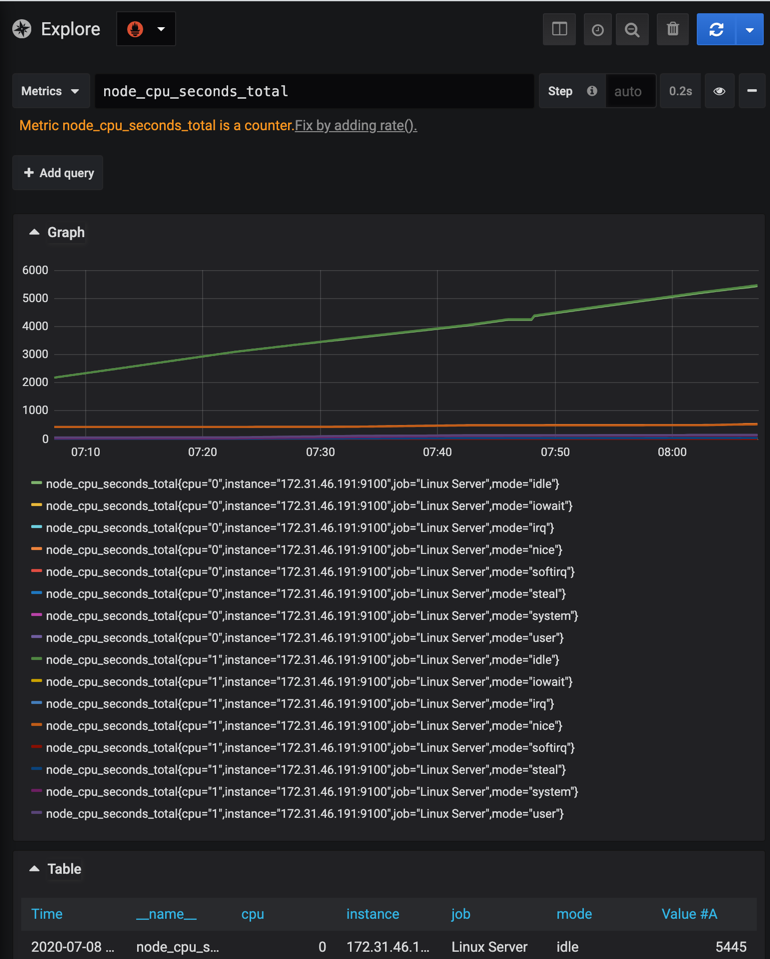

## Grafana

#### What is grafana
- open source analytics and monitoring tool

#### What can you do using grafana. 
- Retrieve prometheus data using queries. 
- Display results in a different UI templates. 
- Collect different panels in a single dashboard. 

### Installing grafana

```shell script
sudo apt-get install -y apt-transport-https software-properties-common wget
wget -q -O - https://packages.grafana.com/gpg.key | sudo apt-key add -
sudo add-apt-repository "deb https://packages.grafana.com/oss/deb stable main"

sudo apt-get update
sudo apt-get install grafana=6.6.2
sudo systemctl enable grafana-server
sudo systemctl start grafana-server
sudo systemctl status grafana-server

```

#### Accessing grafana
hit <public ip>:3000



- enter "admin/admin" change the password




#### Add datasource

- Enter the prometheus server private ip:9090



- could see data source is working..

#### Accessing prometheus via Grafana. 

Enter prometheus query in the grafana dashboard and check the result. 



