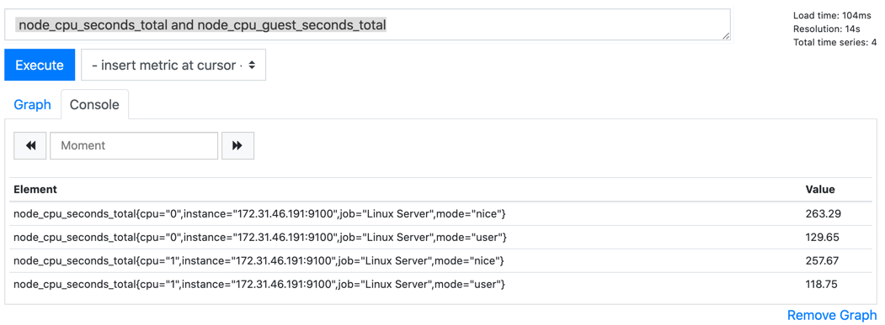

## Querying
- Allows operator to work with metric collected. 

#### Selectors

Examples:
```text
- node_cpu_seconds_total
- node_cpu_seconds_total{mode="system"}
- node_cpu_seconds_total{cpu="0"}
- node_cpu_seconds_total{cpu !="0"}
- node_cpu_seconds_total{cpu=~"0"}
- node_cpu_seconds_total{mode=~"s.*"}
- node_cpu_seconds_total{mode=~"user|system"}
- node_cpu_seconds_total{mode!~"user|system"}
```

#### Range vector Selector
Represents range

Examples:
```text
- node_cpu_seconds_total{cpu="1"}[5m]
```

#### Offset modifier

```
- node_cpu_seconds_total[5m] offset 30m
```

### Query Operators
- used to perform operators

#### Arithmetic operators

```text
- node_cpu_seconds_total * 2

```
Supports (+, -, *, /, %, ^)

```text
node_cpu_seconds_total{mode="system"} + ignoring(mode) node_cpu_seconds_total{mode="user"}
node_cpu_seconds_total{mode="system"} + on(cpu) node_cpu_seconds_total{mode="user"}
```

#### Comparision operators

```text
- node_cpu_seconds_total == 0
- node_cpu_seconds_total != 0
node_cpu_seconds_total == bool 0
```
Supports (==, ~=, >, <, >=, <=)

#### Logical set / Binary operators

```text
 node_cpu_seconds_total and node_cpu_guest_seconds_total

```


Supports (and, or, unless)

```text
- avg(node_cpu_seconds_total{mode="idle"})
- sum(node_cpu_seconds_total{mode="idle"})
- max(node_cpu_seconds_total{mode="idle"})
```
#### Aggregation operators

Supports 
- sum
- min
- max
- avg
- count
- bottomk
- topk
- quantile

### Query functions
- has built in functions that can be used to enhance the result. 

```text
- clamp_max(node_cpu_seconds_total{cpu="0"}, 1000)

```
Supports:
- abs()
- clamp_max()
- clamp_min()
- rate()

### HTTP APIS:
- also provide http end points that can be used by custom scripts / tools to query prometheuse / get results. 

curl localhost:9090/api/v1/query?query=node_cpu_seconds_total


