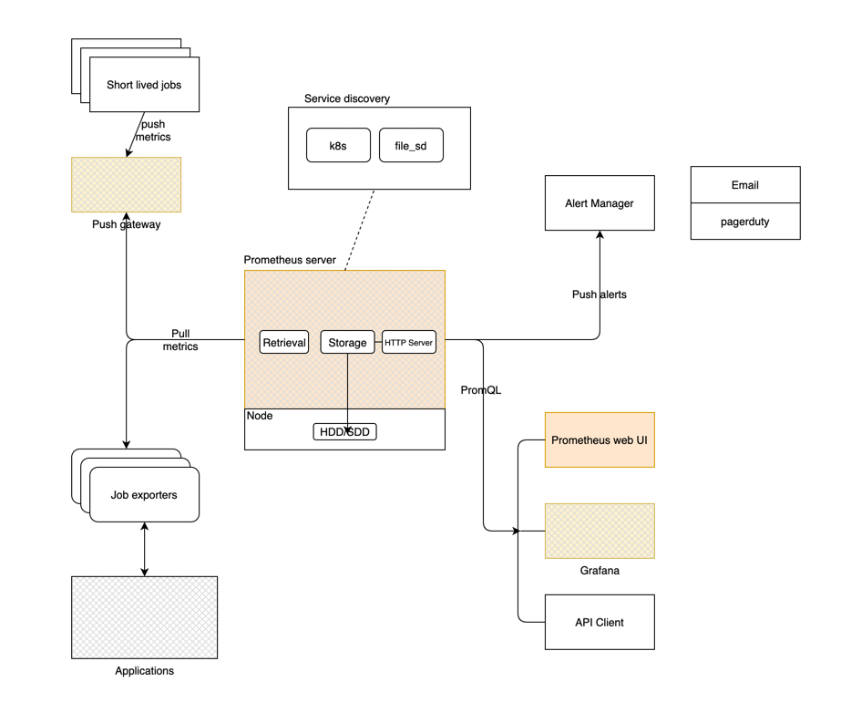

## Prometheus

#### What is prometheus

Prometheus is an open source monitoring and alerting tool built around time series data. It connects to different source application, 
pulls metrics and allows the user to view, query and manage alerts based on the data.

#### What can you do using prometheus
- monitor health of on-premis VMs and its usage. 
- Discover what is the problem in case of an outage. 
- Create  dashboard to explain what is the problem. 
- Setup alerts whenever there is an issue that is about to happen. 

### Architecture:

</img>
[Architecture](overview/Architecture/readme.md)

#### Setting up prometheus
- [Setup](setup/from-binaries/readme.md)

#### Basic terminologies.
- [Basics](overview/basics/readme.md)
- [Console Templates](overview/console-templates/readme.md)
- [Exporters](overview/exporter/readme.md)
- [PromQL](overview/promql/readme.md)
- [Alert manager](overview/alert-manager/readme.md)

#### Grafana
- [Grafana Overview](overview/grafana/readme.md)
