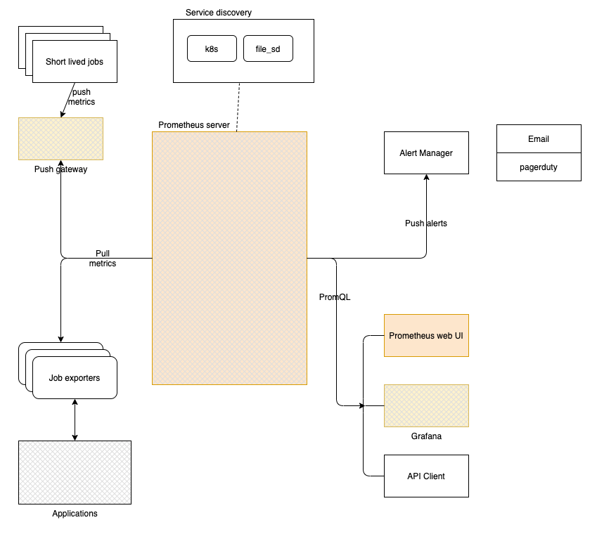

## Prometheus

#### What is prometheus

- open source monitoring and alerting tool. 
- built around time series data. 

Involves:
- Gather metrics
- Visualization
- Alerting

#### Setting up prometheus
- [Setup](setup/from-binaries/readme.md)

#### What can you do using prometheus
- monitor health of on-premis VMs and its usage. 
- Discover what is the problem in case of an outage. 
- Create  dashboard to explain what is the problem. 
- Setup alerts whenever there is an issue that is about to happen. 

### Architecture:
</img>
[Architecture](overview/Architecture/readme.md)

#### Basic terminologies.
- [Basics](overview/basics/readme.md)
- [Console Templates](overview/console-templates/readme.md)
- [Exporters](overview/exporter/readme.md)
- [PromQL](overview/promql/readme.md)

#### Grafana
- [Grafana Overview](overview/grafana/readme.md)

#### Alerting with Prometheus
[Alert manager](overview/alert-manager/readme.md)
