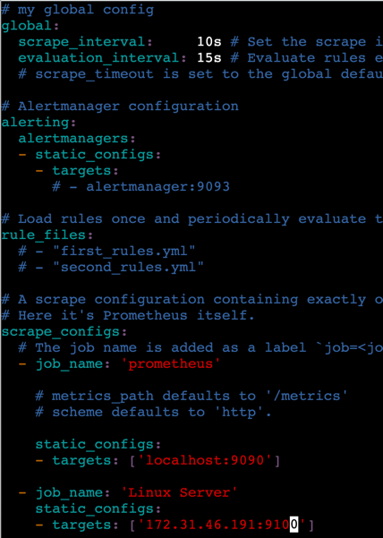

## Installing prometheus. 

Environment: Ubuntu 18.04

```shell script
sudo useradd -M -r -s /bin/false prometheus

sudo mkdir /etc/prometheus /var/lib/prometheus

wget https://github.com/prometheus/prometheus/releases/download/v2.16.0/prometheus-2.16.0.linux-amd64.tar.gz
tar xzf prometheus-2.16.0.linux-amd64.tar.gz prometheus-2.16.0.linux-amd64/
sudo cp prometheus-2.16.0.linux-amd64/{prometheus,promtool} /usr/local/bin/
sudo chown prometheus:prometheus /usr/local/bin/{prometheus,promtool}
sudo cp -r prometheus-2.16.0.linux-amd64/{consoles,console_libraries} /etc/prometheus/
sudo cp -r prometheus-2.16.0.linux-amd64/{consoles,console_libraries} /etc/prometheus/
sudo chown -R prometheus:prometheus /etc/prometheus
sudo chown prometheus:prometheus /var/lib/prometheus
```

Start the server
```shell script
prometheus --config.file=/etc/prometheus/prometheus.yml

sudo vi /etc/systemd/system/prometheus.service

```

```text
[Unit]
Description=Prometheus Time Series Collection and Processing Server
Wants=network-online.target
After=network-online.target

[Service]
User=prometheus
Group=prometheus
Type=simple
ExecStart=/usr/local/bin/prometheus \
    --config.file /etc/prometheus/prometheus.yml \
    --storage.tsdb.path /var/lib/prometheus/ \
    --web.console.templates=/etc/prometheus/consoles \
    --web.console.libraries=/etc/prometheus/console_libraries

[Install]
WantedBy=multi-user.target
```

Start as service
```shell script
sudo systemctl daemon-reload
sudo systemctl start prometheus
sudo systemctl enable prometheus
curl localhost:9090
```


## Configuring prometheus

```shell script
sudo vi /etc/prometheus/prometheus.yml

```

```shell script
global:
  scrape_interval: 10s
```

```shell script
sudo killall -HUP prometheusßß
sudo systemctl restart prometheus
curl localhost:9090/api/v1/status/config

```

## Configuring prometheus exporter

Create a simple ubuntu server that will act as a application that will export data for prometheus. 

```shell script
sudo useradd -M -r -s /bin/false node_exporter

// Installing node node_exporter
wget https://github.com/prometheus/node_exporter/releases/download/v0.18.1/node_exporter-0.18.1.linux-amd64.tar.gz
tar xvfz node_exporter-0.18.1.linux-amd64.tar.gz
sudo cp node_exporter-0.18.1.linux-amd64/node_exporter /usr/local/bin/
sudo chown node_exporter:node_exporter /usr/local/bin/node_exporter

sudo vi /etc/systemd/system/node_exporter.service

```

```text
[Unit]
Description=Prometheus Node Exporter
Wants=network-online.target
After=network-online.target

[Service]
User=node_exporter
Group=node_exporter
Type=simple
ExecStart=/usr/local/bin/node_exporter

[Install]
WantedBy=multi-user.target
```

Run as a service
```shell script
sudo systemctl daemon-reload
sudo systemctl start node_exporter
sudo systemctl enable node_exporter
```

Test if node exporter is working
```shell script
curl localhost:9100/metrics
```

## Configure prometheus to pull from the exporter. 
Edit prometheus configuration file to add a new job that will target the node exporter.

```yaml
 - job_name: 'Linux Server'
    static_configs:
    - targets: ['<app-node-exporter-private-ip>:9100']

```



Reload server
```shell script
sudo killall -HUP prometheus
```

Access:
<public-ip-of-prometheus-server>:9090


## Query explore

```html
* up
* node_filesystem_avail_bytes
* node_cpu_seconds_total
```
